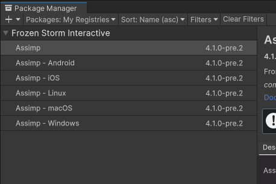
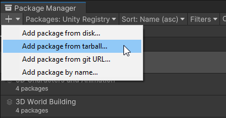

# {{ page.title }}
{: .no_toc }

## Table of contents
{: .no_toc .text-delta }

1. TOC
{:toc}

---

## From Unity Editor

1. Open the Package Manager Settings (**Edit** > **Project Settings** > **Package Manager**) and add a new scoped registry:
   - **Name**: `Frozen Storm Interactive` or whatever you want
   - **URL**: `https://upm.frozenstorminteractive.com`
   - **Scope(s)**: `com.frozenstorminteractive`

   And click on the apply button.

   

1. Open the Package Manager window (**Window** > **Package Manager**) and select **My Registries** from the Packages
drop-down menu.

   

1. Select the package you want to install from the list of packages. The package information appears in the details view.

   

1. Select the version to install. For more information on available versions, see Finding a specific version.

1. Click the Install button.

When the progress bar finishes, the new package is ready to use.

## In the project manifest

1. Add the scoped repository into the `Packages/manifest.json`:
   ```json
   "scopedRegistries": [
     {
       "name": "Assimp",
       "url": "https://upm.frozenstorminteractive.com/",
       "scopes": [
         "com.frozenstorminteractive"
       ]
     }
     ...
   ],
   ...
   ```

1. Add the packages in the dependencies into the `Packages/manifest.json`:
   ```json
     "dependencies": {
       ...
       "com.frozenstorminteractive.assimp": "<version>",
       "com.frozenstorminteractive.assimp.windows": "<version>",
       "com.frozenstorminteractive.assimp.linux": "<version>",
     }
     ...
   ```

   

1. Let Unity fetch the package

## From a tarball file

1. Download the packages from [Github Releases](https://github.com/intelligide/assimp-unity/releases)

1. Click the add (+) button in the status bar

1. Select **Add package from tarball...** from the add menu to bring up a file browser.

   

1. Navigate to the folder where you saved your tarball and select it.
